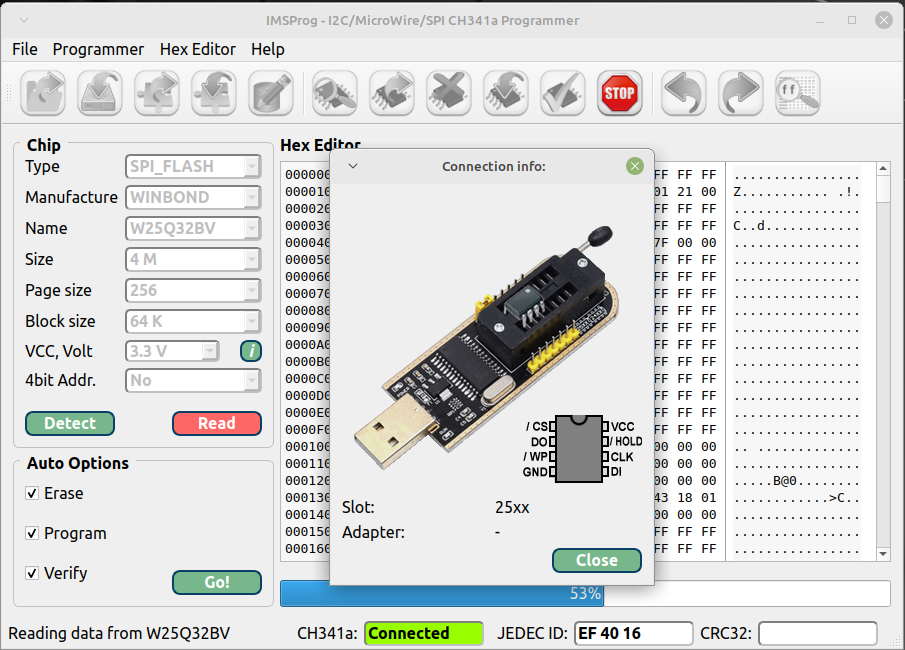
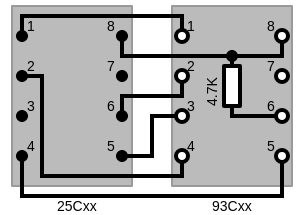

# IMSProg
IMSProg - Linux IMSProg - I2C, SPI and MicroWire EEPROM/Flash chip programmer for CH341a devices.
The IMSProm is a free I2C EEPROM programmer tool for CH341A device based on [QhexEdit2](https://github.com/Simsys/qhexedit2) and
modify [SNANDer programmer](https://github.com/McMCCRU/SNANDer).

   

This is a GUI program used widget QhexEditor. For setting the SPI chip parameters you can use the `Detect` button for reading chip parameters (JEDEC information reading) or manually setting it. The I2C and MicroWire EEPROM only manually selected.

The chip database format is clone with EZP2019, EZP2020, EZP2023, Minpro I, XP866+ programmers. You can edit the database use the [EZP Chip data Editor](https://github.com/bigbigmdm/EZP2019-EZP2025_chip_data_editor)

 

## Building programmer
```
cd IMSProg_programmer
mkdir build
cd build
cmake ..
make -j4
sudo make install
```
## Building editor
```
cd IMSProg_editor
mkdir build
cd build
cmake ..
make -j4
sudo make install
```


## System software requirements
- cmake library
  
`sudo apt install cmake`

- libusb library

`sudo apt-get install libusb-1.0-0 libusb-dev libusb-1.0-0-dev`

- Qt5 library

`sudo apt-get install qtbase5-dev`

- pkg config

`sudo apt-get install pkg-config`

## How to use:

### Connecting
- Insert the chip into the appropriate slot of the CH341a programmer. The `24xxx` and `25xxx` series chips must be inserted directly, according to the markings on the PCB of the CH341a programmer. The `93xxx` series chips must be inserted into the `93xxx adapter` and the adapter into the marking `25xxx` programmer slot.


 
- If the chip supply voltage is 1.8 volt he must be insreted in `1.8 volt adapter` and the adapter into needed   programmer slot.


- Plug the CH341a programmer into the USB socket your computer and running the `IMSProg`.
- You can plug and unplug the programmer device (CH341a) to the USB port at any time when basic operations (reading, checking, and programming) are not in progress.

### Chip type selecting
Select the type of chip used from the `Type` pop-up menu: `SPI FLASH` when using SPI NOR FLASH chips of the `25xxx` series, `24_EEPROM` when using i2c EEPROM of the `24xxx` series, `93_EEPROM` when using MicroWire EEPROM of the `93xxx` series.
When using `25xxx` series SPI NOR FLASH chips, the `Detect` button will be available. When the `Detect` button or  or `<Ctrl+D>` is pressed, the JEDEC information is read from the chip and all parameters of that chip are loaded from the chip database. Any parameter (`size`, `page size`, `block size`, `VCC voltage`, `and 4-bit address length`) can be changed manually.  You can manually enter the `Manufacture` and `Name` pop-up menu data - all other parameters will be automatically loaded from the chip database.  
When using `24xxx` or `93xxx` series chips, it is necessary to manually enter the `Manufacture` and `Name` pop-up menu data - all other parameters will be automatically loaded from the chip database.  

### Basic programmer operations
- Pressing `Read` or  or `<Ctrl+R>` to read data from the chip into the computer buffer.
  
- Pressing  or `<Ctrl+W>` to write data from the computer buffer into the chip.

- Pressing  or `<Ctrl+E>` will erase all data in the chip.
- Pressing the  or `<Ctrl+T>` button causes the data in the chip and in the computer buffer to be compared.

The progress bar shows the progress of the read, erase, and verify operations.

- The `Auto' button is used to perform erase, write and verify operations in sequence. If one of these operations is not needed, you can uncheck the checkbox for that operation.

### File operations
- The  or `<Ctrl+S>` button is used to save the computer buffer to a file.

- The  or `<Ctrl+O>` button is used to save the file in the computer buffer.

- The  or `<Ctrl+Shift-S>` button is used to save a part of the computer buffer to a file (the start address and length of the part must be entered). This operation can be used when splitting a binary data image into parts. 

- The  or `<Ctrl+Shift-S>` button is used to load a small file to a certain address in the buffer. The data fragment in the buffer will be replaced with new data from the file.

- The  or `<Ctrl+Q>` button is used to invoke the chip database editor.

### Buffer (Hex editor) operations
The hexadecimal chip editor (right side of the screen) is used to display and modify buffer data.

It contains the following controls:  undo,  redo, and the  search/replace. The `[Ctrl+A]` key used to update the CRC24 checksum.

## List of supported chips

### i2C EEPROM
24C01, 24C02, 24C04, 24C08, 24C16, 24C32, 24C64, 24C128, 24C256, 24C512, 24C1024

### MicroWire EEPROM
93C46, 93C56, 93C66, 93C76, 93C86

### SPI NOR Flash
- SPANSION

FL016AIF, S25FL016P, S25FL032P, FL064AIF, S25FL064P, S25FL256S, S25FL128P, S25FL129P, S25FL116K, S25FL132K, S25FL164K

- XTX
  
XT25F02E, XT25F04D, XT25F08B, XT25F16B, XT25F32F, XT25F64F, XT25F128F, XT25W02E, XT25W04D, XT25Q08D(1.8V), XT25Q16D(1.8V), XT25Q64D(1.8V), XT25F128D(1.8V)

- EON
  
EN25B10T, EN25B20T, EN25B40T, EN25B80T
EN25B16T, EN25B32T, EN25B64T, EN25F64, EN25Q40A, EN25Q80B, EN25Q16, EN25Q32C, EN25Q64, EN25Q128, EN25F10A, EN25F20A, EN25F40, EN25F80, EN25F16, EN25F32, EN25S10A(1.8V), EN25S20A(1.8V), EN25S40A(1.8V), EN25S80B(1.8V), EN25S16B(1.8V), EN25S64A(1.8V), EN25QE32A, EN25E10A, EN25E40A, EN25SE16A(1.8V), EN25SE32A(1.8V), EN25T80, EN25QA32B, EN25QA64A, EN25QA128A, EN25QW16A, EN25QW32A, EN25QH16, EN25QH32B, EN25QH64A, EN25QH128A, EN25Q256, EN25QX64A, EN25QX128A, EN25QX256A, EN25QY256A, EN25SX64A(1.8V), EN25SX128A(1.8V)

- ATMEL

AT26DF161, AT25DF321

- MICRON

M25P10, M25P20, M25P40, M25P80, M25P016, M25P32, M25P64, M25P128, N25Q032A, N25Q064A, MT25QL64AB, N25Q128A, MT25QL128AB, N25Q256A, MT25QL256AB, MT25QL512AB, N25Q032A(1.8V), N25Q064A(1.8V), MT25QU64AB(1.8V), N25Q128A(1.8V), MT25QU128AB(1.8V), MT25QU256AB(1.8V), MT25QU512AB(1.8V)

- XMC
  
XM25QH10B, XM25QH20B, XM25QH40B, XM25QH80B, XM25QH16C, XM25QH32B, XM25QH64C, XM25QH128C, XM25QH256C, XM25QH512C, XM25LU64C(1.8V), XM25LU128C(1.8V), XM25QU256C(1.8V), XM25QU512C(1.8V), XM25QW16C, XM25QW32C, XM25QW64C, XM25QW128C, XM25QW256C, XM25QW512C, XM25QU41B(1.8V), XM25QU80B(1.8V), XM25QU16C(1.8V), XM25LU32C(1.8V), XM25QH32A, XM25QH64A, XM25QH128A

- AMIC
  
A25L10PU, A25L20PU, A25L40PU, A25L80PU, A25L16PU, A25L10PT, A25L20PT, A25L40PT, A25L80PT, A25L16PT, A25L010, A25L020, A25L040, A25L040, A25L080, A25L016, A25L032, A25LQ080, A25LQ16, A25LQ32, A25LQ64

- EXCELSEMI
  
ES25P10, ES25P20, ES25P40, ES25P80, ES25P16, ES25P32, ES25M40A, ES25M80A, ES25M16A

- DOUQI
  
DQ25Q64AS

- Zbit
  
ZB25LD10A(1.8V), ZB25LD20A(1.8V), ZB25LD40B(1.8V), ZB25LD80(1.8V), ZB25D10A, ZB25D20A, ZB25D40B, ZB25D80B, ZB25VQ16, ZB25VQ32, ZB25VQ64, ZB25VQ128, ZB25LQ16(1.8V), ZB25LQ32(1.8V), ZB25LQ64(1.8V), ZB25LQ128(1.8V), ZB25VQ20A, ZB25VQ40A, ZB25VQ80A, ZB25VQ16A

- ONSemi

LE25U20AMB, LE25U40CMC

- Boya
  
BY25Q05AW, BY25Q10AW, BY25Q20BL(1.8V), BY25Q40BL(1.8V), BY25Q80AW(1.8V), BY25Q16BL(1.8V), BY25D05AS, BY25D10AS, BY25D20AS, BY25D40AS, BY25Q80BS, BY25Q16BS, BY25Q32BS, BY25Q64AS, BY25Q128AS, BY25Q256ES, BY25Q10AL(1.8V), BY25Q20AL(1.8V), BY25Q40AL(1.8V), BY25Q32AL(1.8V), BY25Q64AL(1.8V), BY25Q128EL(1.8V)

- PFLASH

Pm25LQ512B, Pm25LQ010B, Pm25LQ020B, PM25LQ016, PM25LQ032, PM25LQ064, PM25LQ128, Pm25LQ040B

- Puya

P25Q06H, P25Q40H, P25Q11H, P25Q21H, P25Q10H, P25Q20H, P25Q40H, P25Q80H, P25Q16H, P25Q32H, P25Q64H, P25Q128H

- ESMT

F25L004A, F25L008A, F25L016, F25L032, F25L064, F25L16QA, F25L32QA, F25L64QA

- ISSI
  
IS25LQ010, IS25LQ020, IS25LP080D, IS25LP016D, IS25LP032D, IS25LP064D, IS25LP128F, IS25LP256D, IS25LP512D, IS25WP040D(1.8V), IS25WP080D(1.8V), IS25WP016D(1.8V), IS25WP032D(1.8V), IS25WP064D(1.8V), IS25WP128F(1.8V), IS25WP256D(1.8V), IS25WP512D(1.8V)

- Fudan
  
FM25W04, FM25W16, FM25W32, FM25W64, FM25W128, FM25Q04, FM25Q08, FM25Q16, FS25Q32, FS25Q64, FS25Q128

- Zetta
  
ZD25Q64B, ZD25LQ128(1.8V), ZD25LQ64(1.8V), ZD25WD20B, ZD25WD40B, ZD25Q80C, ZD25Q16B, ZD25Q32C

- PCT

PCT25VF016B, PCT25VF032B, PCT25VF064C, PCT25VF020B, PCT25VF040B, PCT25VF080B, PCT26VF016, PCT26VF032, PCT25VF010A

- MXIC

MX25L8005M, MX25L1605D, MX25L3205D, MX25L6405D, MX25L12805D, MX25L25635E, MX25L51245G, MX25U5121E(1.8V), MX25U1001E(1.8V), MX25U2035F(1.8V), MX25U4035F(1.8V), MX25U80356(1.8V), MX25U1632F(1.8V), MX25U3232F(1.8V), MX25U6432F(1.8V), MX25U12832F(1.8V), MX25U25643G(1.8V), MX25U51245G(1.8V), MX25R2035F, MX25R4035F, MX25R8035F, MX25R1635F, MX25R3235F, MX25R6435F

- GigaDevice

GD25F40, GD25F80, GD25D40, GD25D80, GD25D05C, GD25D10C, GD25Q20C, GD25Q40C, GD25Q80C, GD25Q16C, GD25Q32, GD25Q64CSIG, GD25Q128CSIG, GD25Q256CSIG, GD25LD05C(1.8V), GD25LD10C(1.8V), GD25LD20C(1.8V), GD25LD40C(1.8V), GD25LQ80C(1.8V), GD25LQ16C(1.8V), GD25LQ32E(1.8V), GD25LQ64E(1.8V), GD25LQ128(1.8V), GD25LQ256D(1.8V), GD25WD05C, GD25WD10C, GD25WD20E, GD25WD40E, GD25WD80C, GD25WQ20E, GD25WQ40E, GD25WQ80E, GD25WQ16E, GD25WQ32E, GD25WQ64E, GD25WQ128E, GD25WB256E, GD25LB512ME(1.8V), YC25Q128

- PARAGON

PN25F08, PN25F16, PN25F32, PN25F64, PN25F128

- WINBOND

W25P80, W25P16, W25P32, W25X05, W25X10, W25X20, W25X40, W25X80, W25X16, W25X32VS, W25X64, W25Q20CL, W25Q40BV, W25Q80BL, W25Q16DV, W25Q32BV, W25Q64BV, W25Q128BV, W25Q256FV, W25Q20BW(1.8V), W25Q80, W25Q10EW(1.8V), W25Q20EW(1.8V), W25Q40EW(1.8V), W25Q80EW(1.8V), W25Q16JW(1.8V), W25Q32FW(1.8V), W25Q64DW(1.8V), W25Q128FW(1.8V), W25Q256JW(1.8V), W25M512JW(1.8V), W25Q512JV, W25M512JV, W25Q32JW(1.8V)

- Fidelix

FM25Q04A, FM25Q08A, FM25Q16A, FM25Q32A, FM25Q64A, FM25Q128A, FM25M04A(1.8V), FM25M08A(1.8V)
FM25M16A(1.8V), FM25M32B(1.8V), FM25M64A(1.8V)

## Revision history
- Ver. 1.0.0 - 1.0.20 - Partially working versions.
- Ver. 1.0.21 - Working, unstable version
- Ver. 1.0.22 - Working, stable version. Added languages.
- Ver. 1.0.23 - Working, stable version. Removed unused C-functions and variable tables in code. Fix translations. Corrected cleaning of JEDEC ID line edit. Added chips to the database. Correction of database entries.
- Version 1.0.24 - Added STOP key to the interface. Improved interface rendering. Fixes to translations.
